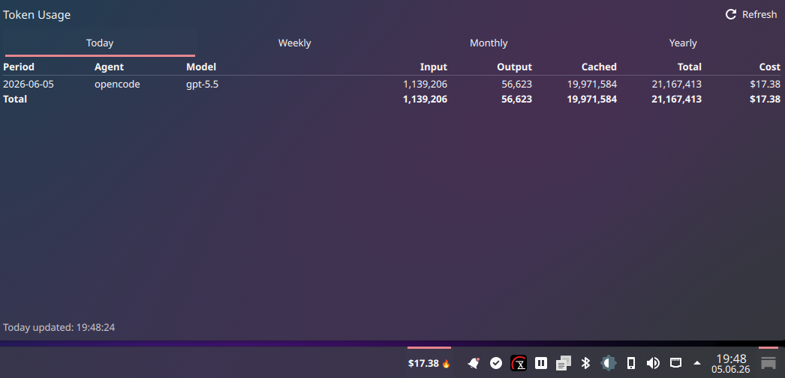
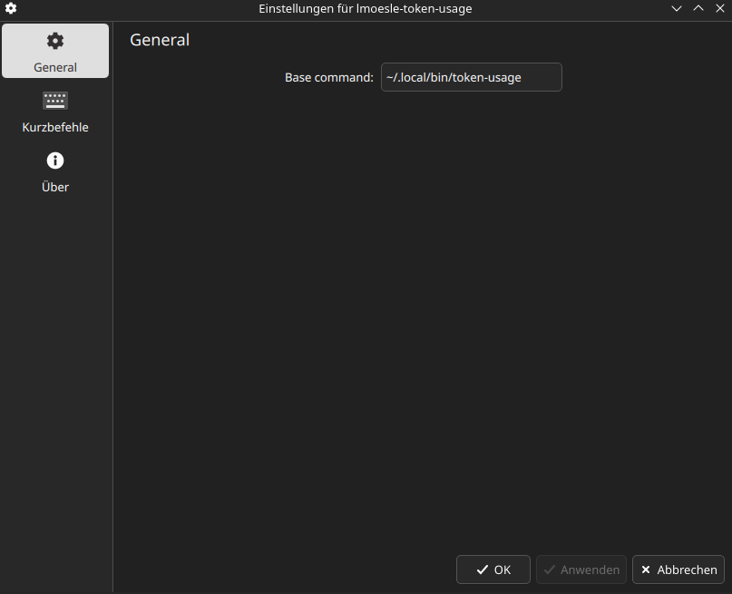

# token-usage-kde-widget



## About

KDE Plasma 6 widget for tracking AI token usage costs in your panel.

The widget is a UI wrapper around the [`token-usage`](https://github.com/lmoesle/token-usage) command-line tool. It shows today's total cost in the panel as `$0.00 🔥` and opens a tabbed table for today, weekly, monthly, and yearly usage.

The widget package id and display name are `lmoesle-token-usage`.

## Getting Started

Download and install the widget package:

```sh
curl -L -o lmoesle-token-usage.plasmoid https://github.com/lmoesle/token-usage-kde-widget/releases/download/v1.0.0/lmoesle-token-usage.plasmoid
kpackagetool6 --type Plasma/Applet --install lmoesle-token-usage.plasmoid
```

If the widget is already installed, upgrade it instead:

```sh
kpackagetool6 --type Plasma/Applet --upgrade lmoesle-token-usage.plasmoid
```

Create a `token-usage` wrapper script so Plasma can run the CLI. Plasma does not load aliases from `.bashrc`, and nvm's Node path is usually missing from Plasma's environment.

Adjust the Node path if your nvm version differs:

```sh
mkdir -p ~/.local/bin
printf '%s\n' '#!/usr/bin/env sh' 'export PATH="$HOME/.nvm/versions/node/v24.16.0/bin:$PATH"' 'exec npx --yes @lmoesle/token-usage-cli "$@"' > ~/.local/bin/token-usage
chmod +x ~/.local/bin/token-usage
```

Verify the CLI wrapper:

```sh
~/.local/bin/token-usage today --raw
```

Add the widget to your panel from Plasma's widget picker. If the widget cannot find `token-usage`, open the widget settings and use the full path in `Base command`. E.g.:

```sh
~/.local/bin/token-usage
```



## Structure

```txt
package/
├── metadata.json
└── contents
    ├── config
    │   ├── config.qml
    │   └── main.xml
    └── ui
        ├── configGeneral.qml
        └── main.qml
```

## Development

Test without installing from the repository root:

```sh
plasmoidviewer -a ./package -s 1100x520
```

Test as a horizontal panel widget:

```sh
plasmoidviewer -a ./package -l topedge -f horizontal -s 1100x520
```

Install or upgrade locally:

```sh
make install
```

Run the installed widget in a window:

```sh
plasmawindowed lmoesle-token-usage
```

Package for distribution:

```sh
make package
```
